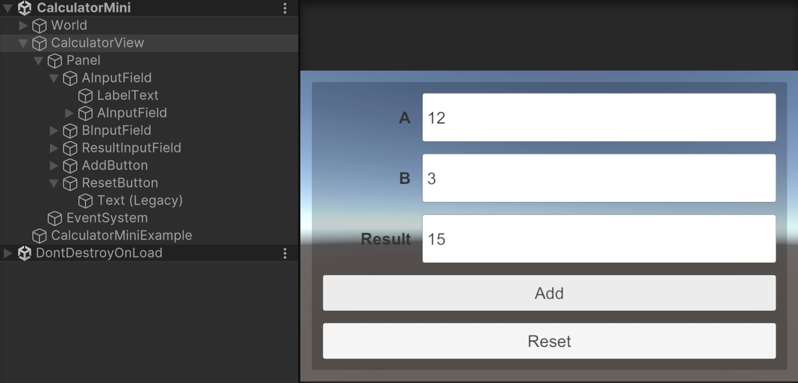
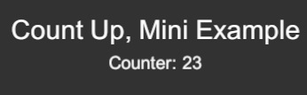
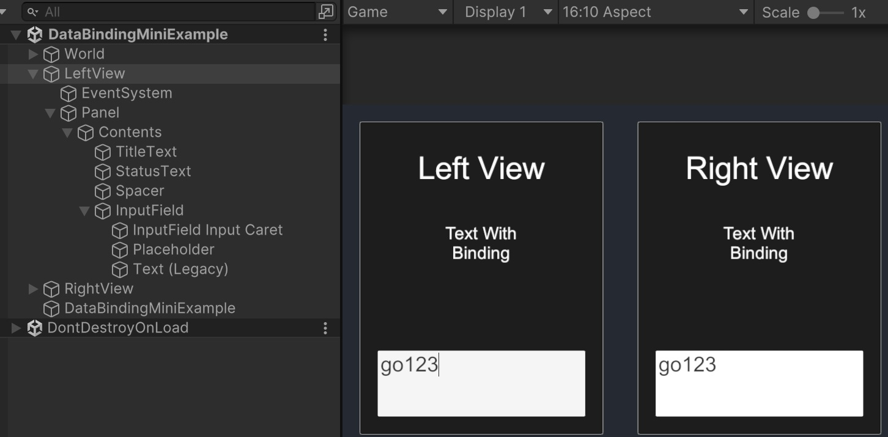
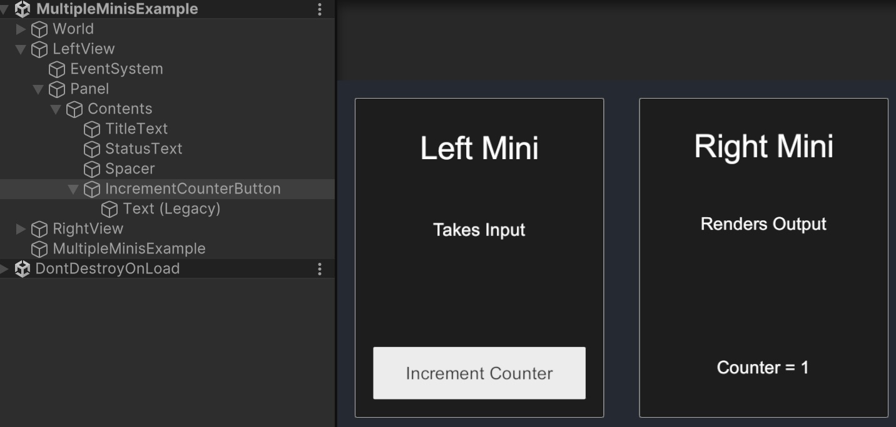
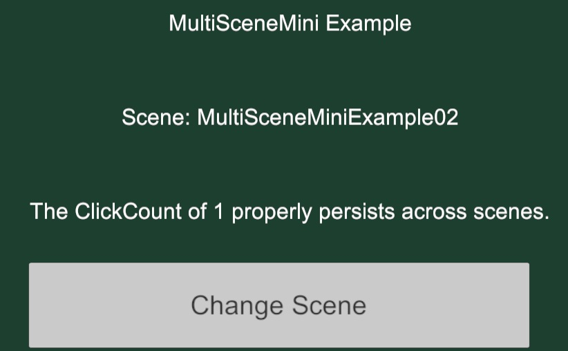
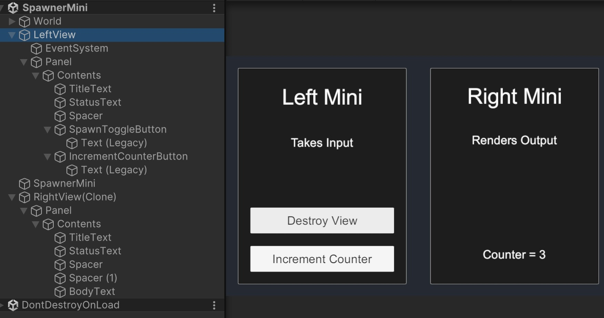
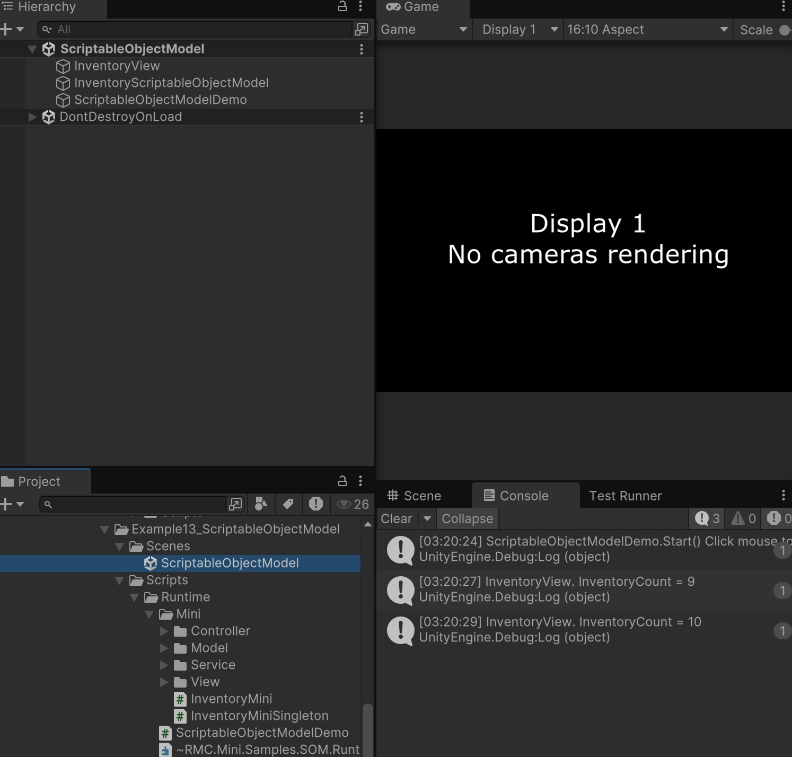

# RMC Tutorial - 4 More

- Path
  1. `RMC Mini MVCS/Samples~/RMC Mini MVCS - 1. Beginner Examples/Examples`
  2. `RMC Mini MVCS/Samples~/RMC Mini MVCS - 2. Advanced Examples/Example01_ConfiguratorMini`
  3. `RMC Mini MVCS/Samples~/RMC Mini MVCS - 3. Unity Gaming Services Examples/Example01_UnityGamingServices`

- [RMC Tutorial - 4 More](#rmc-tutorial---4-more)
  - [4\_Calculator](#4_calculator)
  - [5\_CountUp](#5_countup)
  - [7\_DataBinding](#7_databinding)
  - [8\_MultipleMini](#8_multiplemini)
  - [10\_UIToolkit](#10_uitoolkit)
  - [11\_MultipleScene](#11_multiplescene)
  - [12\_Spawner](#12_spawner)
  - [13\_ScriptableObject](#13_scriptableobject)
  - [Advanced: 01\_ConfiguratorMini](#advanced-01_configuratormini)
  - [Unity Game Service: 01\_UnityGamingServices](#unity-game-service-01_unitygamingservices)

## 4_Calculator

- `Start() { new CalculatorSimpleMini([SerializeField] _calculatorView).Initialize(); }`
- CalculatorSimpleMini: ISimpleMiniMvcs
  - init MVC with ModelLocator
- CalculatorModel : BaseModel
  - public Properties, private SerializeField
  - Observable
- CalculatorView : MonoBehaviour, IView
  - UnityEvent, public Properties, private SerializeField
  - field.(onValueChanged/onClick).AddListener(eventHandler) => Invoke
- CalculatorController : IController
  - Implement data binding of Model and View

## 5_CountUp

- CountUpService: BaseService
  - Load -> LoadAsync -> `(LoadedUnityEvent) OnLoaded.Invoke();`
  - TextAsset textAsset = Resources.Load<TextAsset>("Texts/CountUpWithMiniText"); //txt file. value: 22
- CountUpController: BaseController
  - _service.OnLoaded.AddListener(Service_OnLoaded);
    - View_OnScreenClicked
    - Model_OnCounterChanged
  - _service.Load()
- CounterChangedCommand: ValueChangedCommand<int>
  - CounterChangedCommand(int previousValue, int currentValue)
- CountUpView: MonoBehaviour, IView
  - Unity `Update() { (ScreenClickedUnityEvent) OnScreenClicked.Invoke(); }`
  - Context.CommandManager.AddCommandListener<CounterChangedCommand>(OnCounterValueChangedCommand);

## 7_DataBinding

- LeftView/RightView: MonoBehaviour, IView
  - Setup
    - Context.ModelLocator.GetItem<DataBindingMiniModel>();
  - If Model Changes
    - dataBindingMiniModel.Message.OnValueChanged.AddListener(Message_OnValueChanged, true);
      - {_inputField.text = currentValue; }
  - If View Changes
    - _inputField.onValueChanged.AddListener(InputField_OnValueChanged);
      - Context.ModelLocator.GetItem<DataBindingMiniModel>();
      - dataBindingMiniModel.Message.Value = value;

## 8_MultipleMini

## 10_UIToolkit

## 11_MultipleScene

## 12_Spawner

## 13_ScriptableObject

## Advanced: 01_ConfiguratorMini

## Unity Game Service: 01_UnityGamingServices
